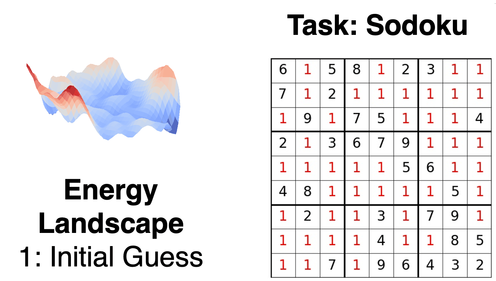

# Learning Iterative Reasoning through Energy Diffusion
Pytorch implementation for the Iterative Reasoning Energy Diffusion (IRED).

<table style="width: 100%;" border="0" style="border: 0px">
    <tr>
        <td style="vertical-align: top; padding-right: 20px; width: 50%" width="50%" border="0">
            <div align="left">
                
            </div>
        </td>
        <td style="vertical-align: top; width: 50%" width="50%" border="0">
            <h3><a href="https://energy-based-model.github.io/ired/">Learning Iterative Reasoning through Energy Diffusion</a></h3>
            <p>
                <a href="https://yilundu.com/">Yilun Du</a>*,
                <a href="http://jiayuanm.com">Jiayuan Mao</a>*, and
                <a href="https://web.mit.edu/cocosci/josh.html">Joshua B. Tenenbaum</a>
                <br />
                In International Conference on Machine Learning (ICML), 2024
                <br />
                <a href="http://energy-based-model.github.io/ired/ired.pdf">[Paper]</a>
                <a href="https://energy-based-model.github.io/ired/">[Project Page]</a>
            </p>
        </td>
    </tr>
</table>

```
@InProceedings{Du_2024_ICML,
    author    = {Du, Yilun and Mao, Jiayuan and Tenenbaum, Joshua B.},
    title     = {Learning Iterative Reasoning through Energy Diffusion},
    booktitle = {International Conference on Machine Learning (ICML)},
    year      = {2024}
}
```

## Continuous-Space Reasoning Tasks

```
python3 train.py --dataset addition --data-workers 4 --batch_size 2048 --use-innerloop-opt True --supervise-energy-landscape True
python3 train.py --dataset lowrank --data-workers 4 --batch_size 2048 --use-innerloop-opt True --supervise-energy-landscape True
python3 train.py --dataset inverse --data-workers 4 --batch_size 2048 --use-innerloop-opt True --supervise-energy-landscape True
```

## Discrete-Space Reasoning Tasks

```
python3 train.py --dataset sudoku --batch_size 64 --model sudoku   --cond_mask True  --supervise-energy-landscape True   --use-innerloop-opt True
python3 train.py --dataset connectivity-2 --batch_size 512 --model gnn --data-workers 20 --use-innerloop-opt True --supervise-energy-landscape True
```

## Planning Tasks

```
python3 ./gen_planning_dataset.py shortest-path --size 100000   # takes around 10 mins.
python3 ./gen_planning_dataset.py shortest-path-25 --size 10000 # takes around 2mins.
python train.py --dataset shortest-path-1d --model gnn-conv-1d-v2 --data-workers 2 --batch_size 512 --use-innerloop-opt True --supervise-energy-landscape True
```

